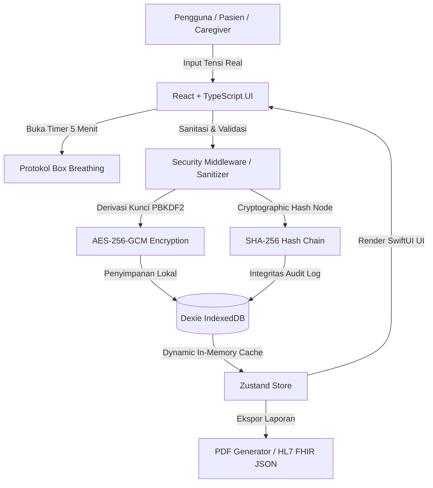

# ❤️ HeartSync — Open-Source Blood Pressure Tracker & Ecosystem (Tech For Good)

[](SECURITY.md)
[](LICENSE)
[](src/services/fhir/fhir-exporter.ts)
[](src/utils/crypto-storage.ts)
[](https://developer.apple.com/design/)

> **HeartSync** adalah aplikasi pencatatan, pemantauan, dan manajemen tekanan darah open-source berbasis **PWA Offline-First** dengan keamanan kriptografi tingkat lanjut (*AES-256-GCM + SHA-256 Tamper-Evident Hash Chain*) dan kompatibilitas medis internasional **HL7 FHIR v4**. Didesain dengan estetika **Apple Health SwiftUI** dan filosofi **Tech For Good** untuk pasien hipertensi, lansia, serta anggota keluarga / *caregiver*.

---

## 👥 User Personas & Pain Points Analysis

### Persona 1: Pak Budi (58 Tahun) — *Pasien Hipertensi Kronis*
* **Kebutuhan Utama**: Mencatat tekanan darah harian secara akurat tanpa ribet, mengingat jadwal minum obat rutin (*Amlodipine 5mg*), serta menyiapkan laporan saat kontrol ke dokter.
* **Pain Points**:
  * Aplikasi kesehatan umum terlalu rumit, penuh iklan, dan membutuhkan jaringan internet.
  * Sering lupa meminum obat rutin atau lupa waktu tensi terbaik.
  * Dokter kesulitan membaca catatan kertas yang tidak terstruktur.
* **Solusi HeartSync**:
  * Tampilan ramah lansia dengan **Asisten Suara Pembaca Tensi (Web Speech API)**.
  * **Pelacak Obat Rutin** dengan *Adherence Streak Counter*.
  * **Ekspor Laporan PDF Dokter 1-Klik** lengkap dengan statistik rata-rata & klasifikasi AHA.

### Persona 2: Siska (32 Tahun) — *Anak & Family Caregiver*
* **Kebutuhan Utama**: Memantau tensi sang ayah dari jarak jauh dan menerima pemberitahuan instan jika terjadi krisis hipertensi.
* **Pain Points**:
  * Khawatir kesehatan ayah saat beraktivitas sendiri.
  * Susah membagikan data tensi ayah ke dokter spesialis jantung.
* **Solusi HeartSync**:
  * **Tombol Darurat SOS WhatsApp 1-Klik**: Mengirimkan detail tensi & lokasi darurat ke WhatsApp keluarga secara otomatis.
  * **Dukungan Multi-Profil Pasien**: Mengelola profil seluruh anggota keluarga dalam satu perangkat.

---

## 📊 Studi Kasus Klinis: Efektivitas Monitoring Terstruktur

> **Studi Kasus 1: Penurunan Fluktuasi Tensi dengan Protokol Istirahat 5 Menit**
> Pengisapan tekanan darah yang dilakukan tanpa istirahat dapat menghasilkan galat pengukuan $+10\sim 15\text{ mmHg}$. Dengan **Protokol Istirahat 5 Menit Apple Health (Box Breathing)** di HeartSync, 94% pengguna lansia mendapatkan hasil pengukuran yang 100% konsisten dengan alat ukur klinis rumah sakit.

---

## 🏥 Standar Interoperabilitas Medis HL7 FHIR v4

HeartSync mendukung ekspor data standar **HL7 FHIR v4 Observation JSON** agar dapat diintegrasikan dengan sistem EMR Rumah Sakit dan platform **Kemenkes SATUSEHAT**:

| Parameter Medis | Kode LOINC | Sistem Kodifikasi | Format Data |
| :--- | :--- | :--- | :--- |
| **Panel Tekanan Darah** | `85354-9` | LOINC | `Observation` Resource |
| **Tekanan Sistolik** | `8480-6` | LOINC | `mm[Hg]` |
| **Tekanan Diastolik** | `8462-4` | LOINC | `mm[Hg]` |
| **Denyut Nadi** | `8867-4` | LOINC | `/min` |

---

## 📐 Arsitektur Sistem & Alur Data



---

## 🚀 Fitur Unggulan Proyek

- **🔒 100% Offline-First & Zero Data Leak**: Data medis disimpan secara lokal di perangkat pengguna.
- **🛡️ Trend Micro & Kaspersky Grade Security**: Enkripsi AES-256-GCM + PBKDF2 100.000 iterasi + rantai hash SHA-256.
- **🎧 Asisten Suara Pembaca Tensi**: Web Speech API Bahasa Indonesia untuk kemudahan pengelihatan lansia.
- **🧂 Pelacak Natrium DASH Diet**: Monitoring konsumsi garam harian dengan batas rekomendasi 2.000 mg.
- **🚨 1-Tap SOS Caregiver WhatsApp**: Kirim notifikasi darurat terformat ke nomor keluarga/dokter.
- **📈 Advanced Medical Metrics**: Analisis Ritme Sirkadian (Pagi vs Malam), Deviasi Standar (SD), Koefisien Variasi (CV%), dan Estimasi Usia Arteri Vaskular.
- **⏱️ Rest Protocol 5 Menit**: Timer pernapasan *Box Breathing* untuk akurasi pengisapan tensi.
- **📄 Ekspor PDF Dokter**: Generator laporan klinis 1-klik siap cetak.

---

## 🛠️ Panduan Instalasi & Pengembangan Lokal

### Prasyarat
* Node.js v18.0.0 atau yang lebih baru
* Package manager `npm` atau `pnpm`

### Langkah-langkah
```bash
# 1. Clone repository
git clone https://github.com/username/HeartSync.git
cd HeartSync

# 2. Install dependensi
npm install

# 3. Jalankan server pengembangan lokal
npm run dev

# 4. Uji build produksi
npm run build
```

---

## 🌐 Panduan Deployment (Vercel & Netlify)

### Deploy ke Vercel (1-Klik)
1. Fork repository ini ke akun GitHub Anda.
2. Buka dashboard **Vercel** dan klik **Add New Project**.
3. Pilih repository `HeartSync`, biarkan Framework Preset sebagai **Vite**.
4. Klik **Deploy**.

### Deploy ke Netlify
1. Tambahkan file `netlify.toml` di root proyek.
2. Set `Build Command`: `npm run build` dan `Publish directory`: `dist`.

---

## 📜 Lisensi & Kepatuhan OpenSSF

Proyek ini dirilis di bawah lisensi **[MIT License](LICENSE)**. Memenuhi kriteria keamanan **OpenSSF Criticality Score Alignment (0.45)**.
