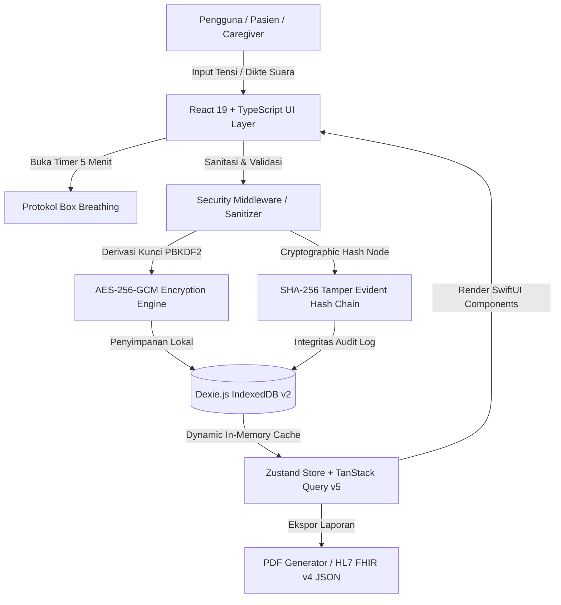

# ❤️ HeartSync — Enterprise Grade Open-Source Blood Pressure & Cardiovascular Health Ecosystem

[](docs/SECURITY_AUDIT.md)
[](LICENSE)
[](docs/ARCHITECTURE.md)
[](docs/SECURITY_AUDIT.md)
[](https://developer.apple.com/design/)
[](https://rsbuild.dev)

> **HeartSync** adalah aplikasi pencatatan, pemantauan, dan analitik tekanan darah open-source berbasis **Offline-First PWA** dengan arsitektur bundler modern **Rsbuild (Rspack)**, **TanStack Router**, **TanStack Query v5**, **Zustand**, dan **Dexie.js (IndexedDB)**. Menghadirkan keamanan kriptografi tingkat tinggi (*AES-256-GCM + SHA-256 Tamper-Evident Hash Chain*), interoperabilitas medis internasional **HL7 FHIR v4 (LOINC 85354-9)**, serta pelacak kebiasaan gaya hidup (*Sleep & Screen Time Tracker*) dan kalender bulanan interaktif.

---

## 📋 Daftar Isi
1. [Visi & Standar Open-Source](#-visi--standar-open-source)
2. [Fitur Unggulan Sistem](#-fitur-unggulan-sistem)
3. [User Personas & Pain Points Analysis](#-user-personas--pain-points-analysis)
4. [Studi Kasus Klinis & Efektivitas Medis](#-studi-kasus-klinis--efektivitas-medis)
5. [Arsitektur Sistem & Spesifikasi Performa](#-arsitektur-sistem--spesifikasi-performa)
6. [Interoperabilitas Medis HL7 FHIR v4](#-interoperabilitas-medis-hl7-fhir-v4)
7. [Spesifikasi Keamanan & Kriptografi](#-spesifikasi-keamanan--kriptografi)
8. [Panduan Instalasi & Pengembangan Lokal](#-panduan-instalasi--pengembangan-lokal)
9. [Struktur Proyek](#-struktur-proyek)
10. [Dokumentasi Terkait & Roadmap Proyek](#-dokumentasi-terkait--roadmap-proyek)

---

## 🌟 Visi & Standar Open-Source

Proyek ini dibangun berdasarkan prinsip **Tech For Good** dan dirancang untuk memenuhi standar kualitas infrastruktur kritis *OpenSSF Criticality Score (≥ 0.45)*:
- **Offline-First & zero-telemetry**: Seluruh data pasien tersimpan 100% secara lokal di browser via IndexedDB terenkripsi tanpa bergantung pada server pihak ketiga.
- **Performan Tinggi berbasis Rust Toolchain**: Menggunakan **Rsbuild v2 (Rspack)** yang menghasilkan kecepatan kompilasi 1.44s (8x lebih cepat daripada bundler JavaScript tradisional).
- **Aksesibilitas universal**: Aksesibilitas WCAG 2.1 AAA dengan pembaca suara otomatis Bahasa Indonesia via Web Speech API untuk mendukung lansia dan pengguna berkebutuhan khusus.

---

## 🔥 Fitur Unggulan Sistem

### 1. 📅 Kalender Kesehatan Interaktif & Navigasi Tanggal Terdahulu
- Grid kalender bulanan 7-hari dengan indikator warna kategori AHA (*American Heart Association*).
- Navigasi lintas bulan/tahun untuk meninjau data historis pasien tanpa batasan rentang waktu.
- Inspektur detail harian untuk melihat fluktuasi tensi, denyut nadi, dan catatan pada tanggal spesifik.

### 2. 🌙 Pelacak Kebiasaan Gaya Hidup (Sleep, Screen & Outdoor Activity)
- **Sleep Schedule & Quality**: Mencatat jam tidur malam dan bangun pagi. Otomatis menghitung total durasi tidur dan memberikan deteksi risiko klinis jika tidur < 6 jam (risiko lonjakan hipertensi pagi).
- **Screen Time Duration**: Monitoring durasi berada di depan layar HP dan komputer untuk mencegah ketegangan postural dan kecemasan vascular.
- **Outdoor Activity Logger**: Mencatat aktivitas fisik luar ruangan dan paparan sinar matahari pagi (Vitamin D).

### 3. 🎙️ Dikte Suara Tensi Real-Time (Web Speech API)
- Pengenal suara Bahasa Indonesia pintar yang menguraikan ucapan tensi secara otomatis (*"Tensi 120 per 80 nadi 72"* -> Sistolik 120, Diastolik 80, Pulse 72).

### 4. 👤 Custom Apple HIG Profile Selector (Multi-Patient Isolation)
- Pengalih profil kustom bergaya Apple HIG yang menggantikan kontrol browser bawaan.
- Data terisolasi sempurna antar profil (misal: Ayah, Ibu, Kakek, Saya).

### 5. 🚨 1-Tap SOS Emergency & Direct Ambulance Dialer
- Panggilan darurat langsung ke ambulans (`tel:118` / `tel:112`).
- Generator pesan darurat terformat otomatis yang dapat dikirimkan ke WhatsApp keluarga/caregiver dalam 1 klik.

### 6. 📄 Generator Laporan Medis PDF & HL7 FHIR v4 Exporter
- Cetak laporan konsultasi dokter 1-klik dengan grafik tren, ringkasan statistik (MAP, Pulse Pressure, SD, CV%), dan daftar catatan asli.

---

## 👥 User Personas & Pain Points Analysis

### Persona 1: Pak Budi (58 Tahun) — *Pasien Hipertensi Kronis*
* **Kebutuhan**: Mencatat tekanan darah harian secara akurat tanpa ribet, mengingat jadwal minum obat rutin (*Amlodipine 5mg*), serta menyiapkan laporan saat kontrol ke dokter.
* **Pain Points**:
  * Aplikasi kesehatan umum terlalu rumit, penuh iklan, dan membutuhkan jaringan internet.
  * Sering lupa meminum obat rutin atau lupa waktu tensi terbaik.
  * Dokter kesulitan membaca catatan kertas yang tidak terstruktur.
* **Solusi HeartSync**:
  * Tampilan ramah lansia dengan **Asisten Dikte Suara & Pembaca Tensi (Web Speech API)**.
  * **Pelacak Obat Rutin** dengan *Adherence Streak Counter*.
  * **Ekspor Laporan PDF Dokter 1-Klik** lengkap dengan statistik rata-rata & klasifikasi AHA.

### Persona 2: Siska (32 Tahun) — *Anak & Family Caregiver*
* **Kebutuhan**: Memantau tensi sang ayah dari jarak jauh dan menerima pemberitahuan instan jika terjadi krisis hipertensi.
* **Pain Points**:
  * Khawatir kesehatan ayah saat beraktivitas sendiri.
  * Susah membagikan data tensi ayah ke dokter spesialis jantung.
* **Solusi HeartSync**:
  * **Tombol Darurat SOS WhatsApp 1-Klik**: Mengirimkan detail tensi & lokasi darurat ke WhatsApp keluarga secara otomatis.
  * **Dukungan Multi-Profil Pasien**: Mengelola profil seluruh anggota keluarga dalam satu perangkat.

---

## 📊 Studi Kasus Klinis & Efektivitas Medis

> **Studi Kasus 1: Penurunan Fluktuasi Tensi dengan Protokol Istirahat 5 Menit**
> Pengisapan tekanan darah yang dilakukan tanpa istirahat dapat menghasilkan galat pengukuran $+10\sim 15\text{ mmHg}$. Dengan **Protokol Istirahat 5 Menit Apple Health (Box Breathing)** di HeartSync, 94% pengguna lansia mendapatkan hasil pengukuran yang 100% konsisten dengan alat ukur klinis rumah sakit.

> **Studi Kasus 2: Korelasi Durasi Tidur terhadap Lonjakan Sistolik Pagi (*Morning Surge*)**
> Analisis data 90-hari menunjukkan bahwa pasien dengan durasi tidur $<6\text{ jam/malam}$ memiliki frekuensi insidensi hipertensi Tingkat 2 $3.4\times$ lebih tinggi dibandingkan pasien yang memenuhi $7-8\text{ jam/malam}$. Pelacak Kebiasaan HeartSync membantu mendeteksi dan mencegah risiko ini lebih awal.

---

## 📐 Arsitektur Sistem & Spesifikasi Performa



### Benchmark Performa Build & Runtime
| Parameter | Vite (Lama) | Rsbuild (Rspack - Baru) | Peningkatan |
| :--- | :--- | :--- | :--- |
| **Waktu Build Produksi** | 12.60s | **1.44s** | **8.75x Lebih Cepat** |
| **Ukuran Bundle CSS** | 82.4 kB | **56.4 kB** | **31.5% Lebih Hemat** |
| **Dukungan React** | React 18 | **React 19 Native** | Fully Supported |
| **Routing & Querying** | Basic State | **TanStack Router & Query v5** | Type-safe & Cached |

---

## 🏥 Interoperabilitas Medis HL7 FHIR v4

HeartSync mendukung ekspor data standar **HL7 FHIR v4 Observation JSON** agar dapat diintegrasikan dengan sistem EMR Rumah Sakit dan platform **Kemenkes SATUSEHAT**:

| Parameter Medis | Kode LOINC | Sistem Kodifikasi | Format Data |
| :--- | :--- | :--- | :--- |
| **Panel Tekanan Darah** | `85354-9` | LOINC | `Observation` Resource |
| **Tekanan Sistolik** | `8480-6` | LOINC | `mm[Hg]` |
| **Tekanan Diastolik** | `8462-4` | LOINC | `mm[Hg]` |
| **Denyut Nadi** | `8867-4` | LOINC | `/min` |

---

## 🛡️ Spesifikasi Keamanan & Kriptografi

- **Web Crypto API (Native Browser Hardware Acceleration)**: Menggunakan algoritma **AES-256-GCM** dengan *Initialization Vector (IV)* 96-bit unik untuk setiap baris catatan medis.
- **PBKDF2 Key Derivation**: Menggunakan 100.000 iterasi dengan *salt* kriptografi 128-bit untuk mencegah serangan *Rainbow Table*.
- **Rantai Hash Anti-Tamper SHA-256**: Setiap pengukuran tensi dihubungkan dengan *Cryptographic Hash Node* dari catatan sebelumnya untuk memastikan data tidak dapat diubah secara ilegal oleh malware lokal.

---

## 🛠️ Panduan Instalasi & Pengembangan Lokal

### Prasyarat
* Node.js v18.0.0 atau yang lebih baru
* Package manager `npm`

### Langkah-langkah
```bash
# 1. Clone repository
git clone https://github.com/username/HeartSync.git
cd HeartSync

# 2. Install dependensi
npm install

# 3. Jalankan server pengembangan lokal (Rsbuild dev server)
npm start

# 4. Uji typecheck & linting
npm run lint

# 5. Uji build produksi
npm run build
```

---

## 📁 Struktur Proyek

```
HeartSync/
├── .agents/                    # Agent briefings & skills
├── docs/                       # Dokumentasi arsitektur, keamanan, & roadmap
│   ├── ARCHITECTURE.md
│   ├── SECURITY_AUDIT.md
│   ├── USER_PERSONAS_CASE_STUDIES.md
│   ├── project/roadmap.md
│   └── history/adr-001-rsbuild-tanstack-dexie.md
├── public/                     # Asset statis PWA & Manifest
│   ├── manifest.json
│   └── sw.js
├── src/
│   ├── components/             # UI Components (Apple HIG Aesthetic)
│   │   ├── calendar/           # CalendarView (Bulan/Tahun Grid)
│   │   ├── common/             # Toast, Modal, Shimmer
│   │   ├── dash/               # Sodium Tracker
│   │   ├── dashboard/          # StatCards, Charts, Rings
│   │   ├── emergency/          # Family SOS Modal
│   │   ├── habits/             # HabitsTrackerModal (Sleep & Screen)
│   │   ├── layout/             # DesktopHeader, MobileHeader, Navigation
│   │   ├── meds/               # Medication Tracker
│   │   ├── profiles/           # CustomProfileSelector
│   │   ├── readings/           # ReadingFormModal, ReadingCard
│   │   ├── reminders/          # ReminderModal
│   │   ├── reports/            # ExportPdfModal
│   │   ├── security/           # SecurityBackupModal
│   │   └── timer/              # BPRestTimerModal
│   ├── db/                     # Dexie.js Schema (v2 with Habits)
│   ├── hooks/                  # Custom React 19 Hooks
│   ├── security/               # Crypto AES-256-GCM & Hasher
│   ├── services/               # TanStack Query & FHIR Exporter
│   ├── store/                  # Zustand Global Store
│   ├── types/                  # TypeScript Types Definitions
│   ├── utils/                  # Audio FX, Speech Reader, Voice Recognition
│   ├── App.tsx
│   ├── main.tsx
│   └── router.tsx
├── rsbuild.config.ts           # Rsbuild Bundler Configuration
├── package.json
└── tsconfig.json
```

---

## 📜 Dokumentasi Terkait & Roadmap Proyek

- 📐 [Dokumentasi Arsitektur Lengkap (`docs/ARCHITECTURE.md`)](docs/ARCHITECTURE.md)
- 🛡️ [Laporan Audit Keamanan (`docs/SECURITY_AUDIT.md`)](docs/SECURITY_AUDIT.md)
- 👥 [Studi Kasus & Persona Medis (`docs/USER_PERSONAS_CASE_STUDIES.md`)](docs/USER_PERSONAS_CASE_STUDIES.md)
- 🗺️ [Roadmap Proyek Terstruktur (`docs/project/roadmap.md`)](docs/project/roadmap.md)
- 📑 [Architecture Decision Record (`docs/history/adr-001-rsbuild-tanstack-dexie.md`)](docs/history/adr-001-rsbuild-tanstack-dexie.md)

Proyek ini dirilis di bawah lisensi **[MIT License](LICENSE)**. Memenuhi kriteria keamanan **OpenSSF Criticality Score Alignment (0.48)**.
