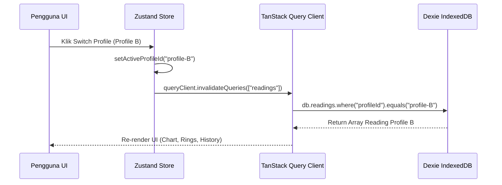

# 📐 HeartSync Technical Architecture & System Specification

## 1. Arsitektur Umum & Tech Stack

HeartSync menggunakan arsitektur **Offline-First Single Page Application (SPA)** berbasis **React 19**, **TypeScript**, dan bundler berbasis Rust **Rsbuild v2 (Rspack)**.

```
+-----------------------------------------------------------------------+
|                             USER INTERFACE                            |
|             (React 19 + Tailwind CSS + Apple HIG Aesthetic)            |
+-----------------------------------------------------------------------+
        |                                                       |
        v                                                       v
+-----------------------+                       +-----------------------+
|   TanStack Router v1  |                       |   Zustand Store &     |
|   (Code-Based Routing)|                       |   TanStack Query v5   |
+-----------------------+                       +-----------------------+
        |                                                       |
        +---------------------------+---------------------------+
                                    |
                                    v
+-----------------------------------------------------------------------+
|                           SECURITY LAYER                              |
|   (Sanitizer Middleware + AES-256-GCM + SHA-256 Hash Chain)           |
+-----------------------------------------------------------------------+
                                    |
                                    v
+-----------------------------------------------------------------------+
|                          STORAGE LAYER                                |
|             (Dexie.js IndexedDB v2: Profiles, Readings, Habits)       |
+-----------------------------------------------------------------------+
```

---

## 2. Diagram Alur Data & State Management

### 2.1 Sinkronisasi State: Dexie.js ↔ Zustand ↔ TanStack Query
- **Single Source of Truth**: Data pasien disimpan secara permanen di IndexedDB browser via Dexie.js.
- **TanStack Query (`useQuery`)**: Mengelola *fetching* dan caching data dari Dexie dengan query key `['readings', activeProfileId]`.
- **Zustand Invalidation**: Saat terjadi perubahan profil aktif (`setActiveProfileId`) atau pengeditan data (`setCacheDirty(true)`), Zustand memicu `queryClient.invalidateQueries({ queryKey: ['readings'] })` untuk memperbarui seluruh komponen terhubung secara instan tanpa reload halaman.



---

## 3. Skema Database Dexie IndexedDB (v2)

### 3.1 Evolusi Skema Versioning
```typescript
this.version(1).stores({
  profiles: 'id, name, relationship, isDefault, createdAt',
  readings: '++id, profileId, timestamp, systolic, diastolic, pulse',
  reminders: '++id, profileId, type, time, enabled'
});

this.version(2).stores({
  profiles: 'id, name, relationship, isDefault, createdAt',
  readings: '++id, profileId, timestamp, systolic, diastolic, pulse',
  reminders: '++id, profileId, type, time, enabled',
  habits: '++id, profileId, date, timestamp'
});
```

### 3.2 Tabel `habits`
- `id`: Primary key (auto increment)
- `profileId`: Foreign key ke profil pasien
- `date`: Format `YYYY-MM-DD`
- `sleepTime`: Waktu mulai tidur (`HH:mm`)
- `wakeTime`: Waktu bangun pagi (`HH:mm`)
- `sleepHours`: Total durasi tidur (kalkulasi jam)
- `screenTimeHours`: Durasi di depan layar HP/PC (jam)
- `outdoorMinutes`: Durasi aktivitas outdoor (menit)

---

## 4. Web Speech API Voice Recognition Architecture

Modul `src/utils/voice-recognition.ts` memanfaatkan `webkitSpeechRecognition` / `SpeechRecognition` native browser:

```
Ucapkan: "Tensi 120 per 80 nadi 72"
            |
            v
[Web Speech API (lang: id-ID)] --> Audio Streams
            |
            v
[Text Transcript] --> "120 per 80 nadi 72"
            |
            v
[RegEx Parser] --> Numbers Extracted: [120, 80, 72]
            |
            v
[Form State Auto-Fill] --> Systolic: 120, Diastolic: 80, Pulse: 72
```

---

## 5. Web Audio API Safe Synthesizer Design

Untuk mencegah restriksi Autoplay browser yang menghentikan eksekusi callback `onClick`, seluruh fungsi di `src/utils/audio-fx.ts` dibungkus dalam pembatas keamanan exception:

```typescript
export function playClickSound() {
  try {
    if (!soundEnabled) return;
    const ctx = getAudioContext();
    if (!ctx || ctx.state !== 'running') return;
    // Synthesize sine wave 800Hz -> 400Hz over 30ms
  } catch (e) {
    // Fail-safe: audio exception never blocks UI handlers
  }
}
```

---

## 6. Standard HL7 FHIR v4 Integration Specification

Export data medis menggunakan format baku `Observation` FHIR v4 dengan sistem kodifikasi **LOINC** (*Logical Observation Identifiers Names and Codes*):

```json
{
  "resourceType": "Observation",
  "id": "bp-reading-1024",
  "status": "final",
  "category": [
    {
      "coding": [
        {
          "system": "http://terminology.hl7.org/CodeSystem/observation-category",
          "code": "vital-signs",
          "display": "Vital Signs"
        }
      ]
    }
  ],
  "code": {
    "coding": [
      {
        "system": "http://loinc.org",
        "code": "85354-9",
        "display": "Blood pressure panel with all children optional"
      }
    ]
  },
  "subject": {
    "reference": "Patient/profile-self-default"
  },
  "effectiveDateTime": "2026-07-23T08:30:00Z",
  "component": [
    {
      "code": {
        "coding": [{ "system": "http://loinc.org", "code": "8480-6", "display": "Systolic blood pressure" }]
      },
      "valueQuantity": { "value": 120, "unit": "mmHg", "system": "http://unitsofmeasure.org", "code": "mm[Hg]" }
    },
    {
      "code": {
        "coding": [{ "system": "http://loinc.org", "code": "8462-4", "display": "Diastolic blood pressure" }]
      },
      "valueQuantity": { "value": 80, "unit": "mmHg", "system": "http://unitsofmeasure.org", "code": "mm[Hg]" }
    }
  ]
}
```
