# HeartSync System Architecture Mermaid Diagram Suite

This document contains 13 formal Mermaid diagrams illustrating the complete software engineering architecture, data pipelines, security encryption flows, entity relationships, and medical interoperability mappings of the **HeartSync** ecosystem.

---

## 1. Flowchart: Telemetry Logging & AHA Risk Classification Flow

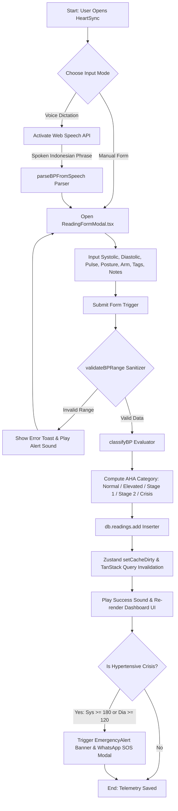

---

## 2. Use Case Diagram: User Roles & System Interactions

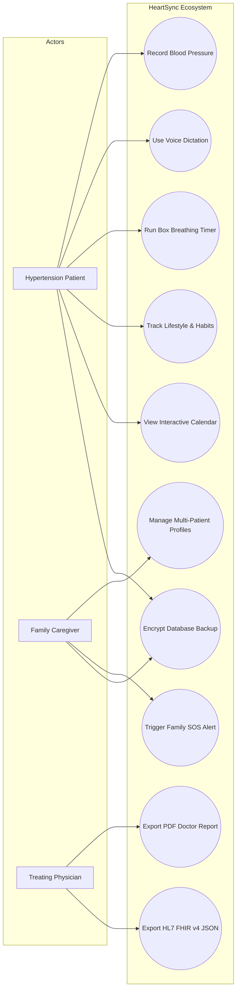

---

## 3. Activity Diagram: 5-Minute Box Breathing & Measurement Activity

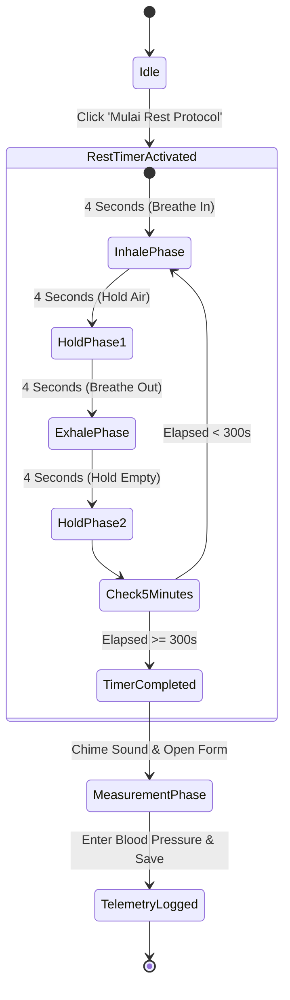

---

## 4. Sequence Diagram: Profile Switch & Query Invalidation Sequence

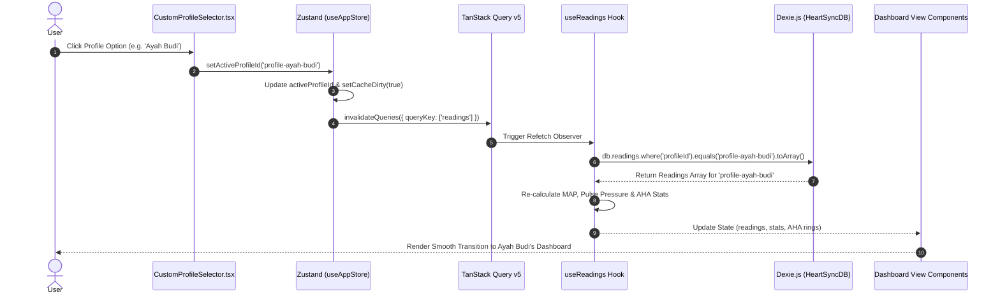

---

## 5. State Diagram: AHA Blood Pressure Category State Machine

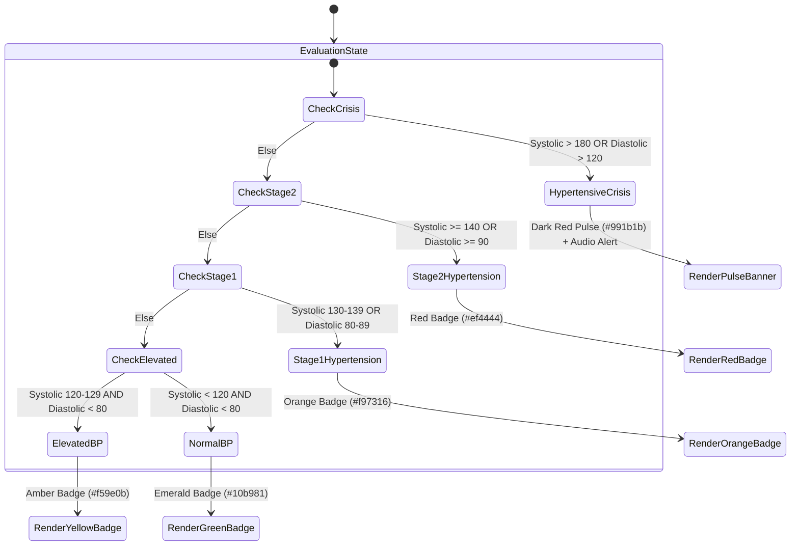

---

## 6. Component Diagram: Decoupled 4-Layer Architecture

```mermaid
componentDiagram
    package "Presentation Layer (UI)" {
        [DesktopHeader]
        [MobileHeader]
        [CustomProfileSelector]
        [CalendarView]
        [ReadingFormModal]
        [HabitsTrackerModal]
        [StatCards]
        [BPTrendChart]
    }

    package "State & Query Layer" {
        [Zustand Store]
        [TanStack Query Cache]
        [TanStack Router]
    }

    package "Middleware Services Layer" {
        [Sanitizer & Hasher]
        [Crypto Storage (AES-256-GCM)]
        [HL7 FHIR Exporter]
        [PDF Report Engine]
    }

    package "Persistence & Hardware Layer" {
        [Dexie.js IndexedDB Engine]
        [Web Speech API Parser]
        [Web Audio Synthesizer]
        [PWA Service Worker]
    }

    [Presentation Layer (UI)] --> [State & Query Layer]
    [State & Query Layer] --> [Middleware Services Layer]
    [Middleware Services Layer] --> [Persistence & Hardware Layer]
```

---

## 7. ER Diagram: IndexedDB Dexie.js Schema Entity Relationships

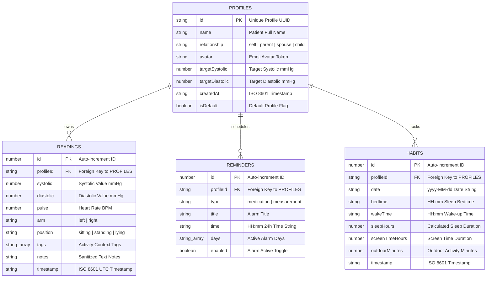

---

## 8. Deployment Diagram: Offline-First Client Architecture

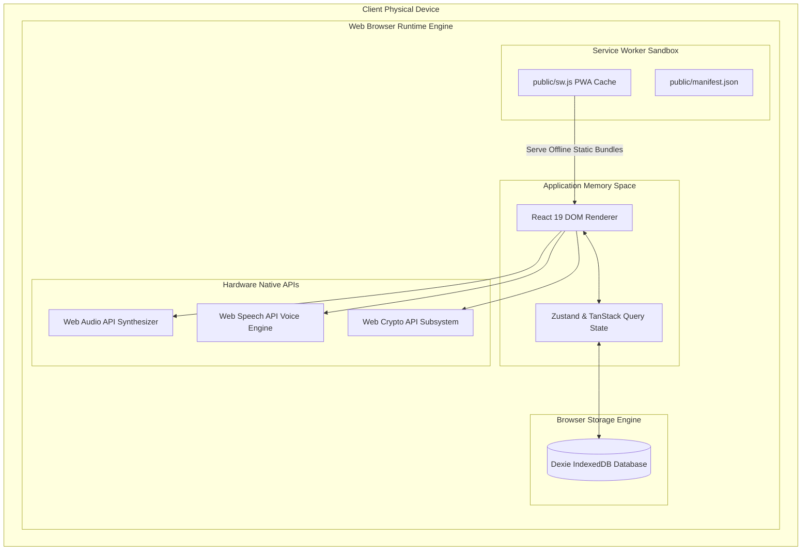

---

## 9. Authentication Flow: Zero-Trust Local & Encryption Auth

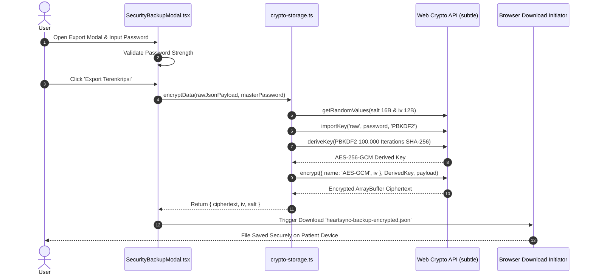

---

## 10. Encryption Flow: AES-256-GCM + PBKDF2 Pipeline

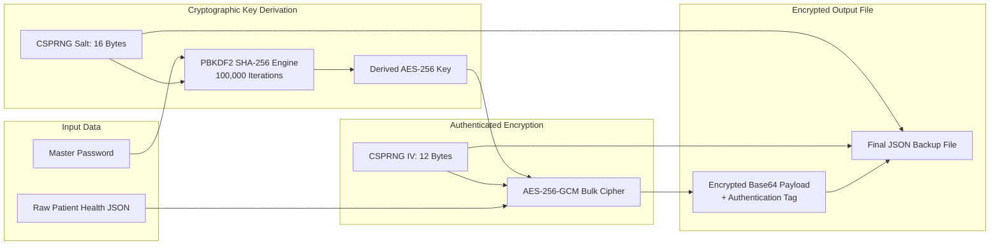

---

## 11. FHIR Mapping: HL7 FHIR v4 Observation LOINC Panel

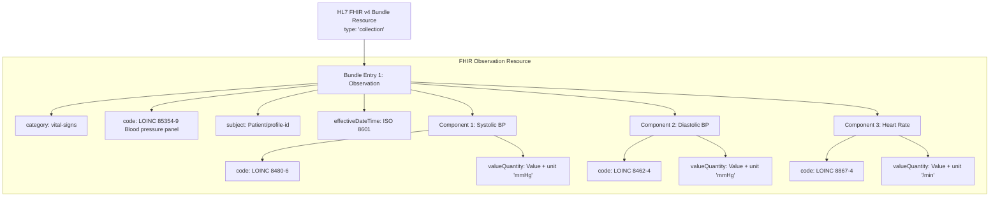

---

## 12. Folder Tree: Visual Workspace Topology

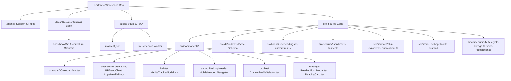

---

## 13. Dependency Graph: Core Package Interconnections

```mermaid
graph TD
    App[src/App.tsx]
    
    subgraph UI & Animation Libraries
        React[react v19.0.0]
        Lucide[lucide-react v0.469.0]
        Framer[framer-motion v12.4.7]
        Recharts[recharts v2.15.0]
    end

    subgraph State & Router Infrastructure
        Zustand[zustand v5.0.3]
        TanStackQuery[@tanstack/react-query v5.62.11]
        TanStackRouter[@tanstack/react-router v1.95.1]
    end

    subgraph Persistence & Tooling
        Dexie[dexie v4.0.10]
        JsPDF[jspdf v2.5.2]
        Rsbuild[@rsbuild/core v2.1.7]
    end

    App --> React
    App --> Lucide
    App --> Framer
    App --> Recharts
    App --> Zustand
    App --> TanStackQuery
    App --> TanStackRouter
    App --> Dexie
    App --> JsPDF
    Rsbuild --> App
```
